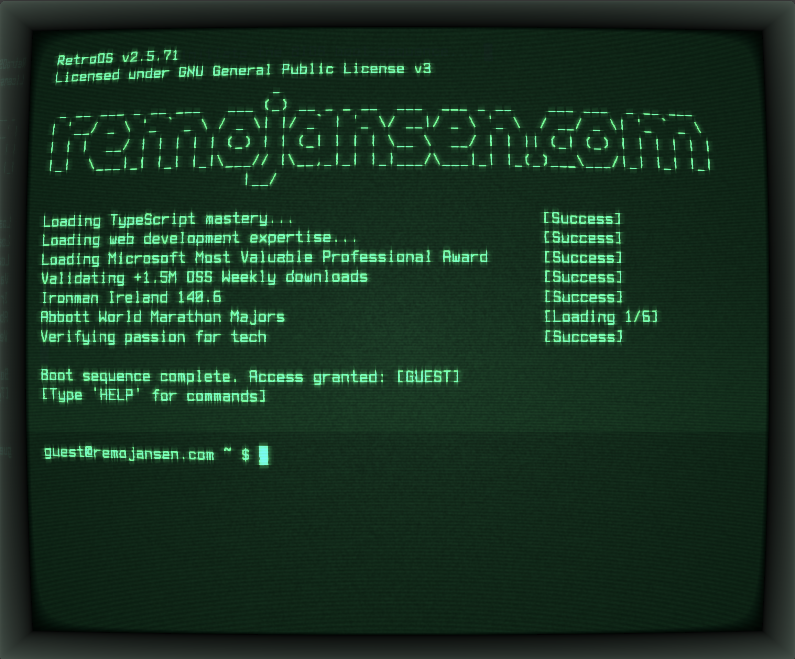

# burmister.com

Adam Burmister's personal CV and portfolio website. Powered by Astro, Vite,
TypeScript, Three.js (WebGL), xterm.js, and Cloudflare.



## Development

```sh
npm run dev
```

## Build

```sh
npm run build
```

## Credit

This site is a reworked personal portfolio based on Remo H. Jansen's
cool-retro-term-webgl project:
https://github.com/remojansen/cool-retro-term-webgl/tree/main

Licensed under GNU General Public License v.3.0. See [LICENSE](LICENSE) for details.
